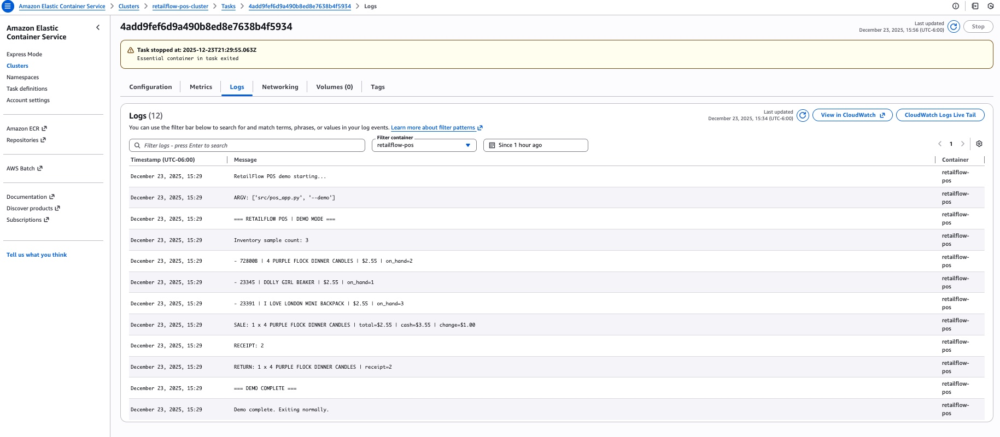

## AWS ECS Fargate – CloudWatch Logs Demo

.

🧾 RetailFlow POS — Cloud-Deployed Demo (AWS ECS Fargate)

RetailFlow POS is a Python-based Point of Sale (POS) system designed to demonstrate backend logic, inventory management, receipts, and cloud-native execution.
This project showcases how a traditionally interactive CLI application can be adapted to run non-interactively in AWS ECS Fargate, with logs streamed to Amazon CloudWatch.

🚀 What This Demo Shows

✅ Dockerized Python application

✅ Deployed to AWS ECS Fargate

✅ Logs captured and viewable in Amazon CloudWatch

✅ Non-interactive “demo mode” execution (cloud-safe)

✅ Inventory, sales, receipts, and returns workflow

✅ Clean container exit (batch-style task)

This is a recruiter-ready cloud demo, not a local-only script.

🏗️ Architecture Overview

Language: Python 3.11

Container: Docker (Linux x86_64 / amd64)

Cloud Runtime: AWS ECS (Fargate launch type)

Image Registry: Amazon ECR

Logging: Amazon CloudWatch Logs

Storage:

Inventory & users: CSV

Receipts & sales: SQLite

📦 Project Structure
retailflow-pos/
├── src/
│   └── pos_app.py
├── data/
│   ├── UsersData.csv
│   ├── RetailStoreItemData.txt
│   └── pos.db
├── Dockerfile
└── README.md

▶️ Running Locally (Optional)
python src/pos_app.py

This runs the interactive CLI version (requires user input).

☁️ Cloud Demo Mode (ECS / CloudWatch)

For cloud execution, the app runs in non-interactive demo mode:

python src/pos_app.py --demo

What demo mode does

Loads users and inventory

Prints a sample of inventory items

Simulates a sale

Generates a receipt

Processes a return

Exits cleanly (no input() calls)

This makes it safe for ECS, batch jobs, and CI/CD pipelines.

📊 Example CloudWatch Output

When run on ECS Fargate, logs look like:

RetailFlow POS demo starting...
Inventory sample count: 3
- 72800B | 4 PURPLE FLOCK DINNER CANDLES | $2.55 | on_hand=2
- 23345  | DOLLY GIRL BEAKER            | $2.55 | on_hand=1
- 23391  | I LOVE LONDON MINI BACKPACK  | $2.55 | on_hand=3
SALE: 1 x 4 PURPLE FLOCK DINNER CANDLES | total=$2.55 | cash=$3.55 | change=$1.00
RECEIPT: 2
RETURN: 1 x 4 PURPLE FLOCK DINNER CANDLES | receipt=2
=== DEMO COMPLETE ===
Demo complete. Exiting normally.

📌 Logs are viewable in Amazon CloudWatch → Log groups → /ecs/retailflow-pos

🐳 Docker Build (Linux x86_64)
docker buildx build \
  --platform linux/amd64 \
  -t retailflow-pos:v3-amd64 \
  .

Image is pushed to Amazon ECR and used by ECS.

🎯 Why This Project Matters

This project demonstrates:

Real-world cloud debugging (architecture mismatch, non-interactive fixes)

Converting a CLI app into a cloud-safe workload

ECS Fargate task lifecycle understanding

Observability with CloudWatch

Production-style container practices

This is not a toy example — it reflects real issues encountered in enterprise cloud deployments.

👤 Author

Mario Renato Carrillo
Data Scientist | Analytics Engineer | Cloud & ML Practitioner

GitHub: (this repo)

AWS: ECS Fargate + CloudWatch demo

Focus: Applied analytics, cloud-native systems, and production ML foundations

🧠 Next Enhancements (Optional)

REST API wrapper (FastAPI)

Persistent inventory via RDS

CI/CD with GitHub Actions

Terraform / IaC

Metrics via CloudWatch dashboards

